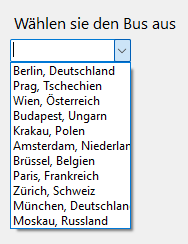

# Glossar

## Inhaltsverzeichnis

- [B](#b)
  - [BCrypt.Net-Next](#bcryptnet-next)
  - [BCrypt](#bcrypt)
- [C](#c)
  - [ComboBox](#combobox)
- [G](#g)
  - [GUI](#gui-graphical-user-interface)
- [H](#h)
  - [Hashing](#hashing)
- [M](#m)
  - [MessageBox](#messagebox)
- [N](#n)
  - [Nuget](#nuget)
  - [Npgsql](#npgsql)
- [T](#t)
  - [TextBox](#textbox)

## B

### BCrypt.Net-Next

Dies ist ein weiteres [Nuget](#nuget) für Visual Studio Projekte welche Methoden bereitstellt, um einen String mit BCrypt zu hashen und auch um einen gehashten String mit einem nicht gehashten abzugleichen.
[BCrypt.Net-Next Nuget](https://www.nuget.org/packages/BCrypt.Net-Next/)

### BCRypt

[BCrypt](https://en.wikipedia.org/wiki/Bcrypt) ist ein speziell für das sichere Speichern von Passwörtern entwickelter Algorithmus. Der Algorithmus integriert automatisch einen Salt und verwendet einen einstellbaren Kostenfaktor, welcher die Berechnung des Hashes absichtlich verlangsamt und somit sicherer gegen Angriffe macht.  
Beispielhash: `$2a$12$R9h/cIPz0gi.URNNX3kh2OPST9/PgBkqquzi.Ss7KIUgO2t0jWMUW`  
In C#/.Net kann BCrypt mit dem [BCrypt.Net-Next](#bcryptnet-next) Nuget-Paket verwendet werden.  

## C

### ComboBox

Die ComboBox ist ein Steuerelement in Windows Forms, das dem Benutzer eine Dropdown-Liste zur Auswahl bietet. Es kann verwendet werden, um dem Benutzer eine Liste von Optionen anzuzeigen, aus der er eine auswählen kann.

ComboBox unterstützt zwei Hauptmodi:

1. Dropdown List: Der Benutzer kann nur eine der vordefinierten Optionen auswählen.
2. Dropdown: Der Benutzer kann entweder eine der vordefinierten Optionen auswählen oder einen eigenen Text eingeben.

Die ComboBox ist nützlich, um Platz im Benutzerinterface zu sparen und die Benutzererfahrung zu verbessern, indem sie eine übersichtliche Auswahlmöglichkeit bietet. In C#/.Net kann eine ComboBox leicht erstellt und konfiguriert werden, um verschiedene Anforderungen in einer Windows Forms-Anwendung zu erfüllen.
  
[ComboBox Dokumentation](https://learn.microsoft.com/de-de/dotnet/api/system.windows.forms.combobox?view=windowsdesktop-8.0)

## G

### GUI (Graphical User Interface)

GUI oder Graphical User Interface ist ein Element mit dem ein Nutzer interagieren kann. Es ist eine visuelle Übersicht für den Nutzer, die ihn mit dem eigentlichen Programm verbindet. Es dient dazu komplexe Befehle, die beispielsweise Konsolenprogramme haben in verständliche Visuelle Aktionen umzuwandeln.
Diese Art der Benutzeroberfläche ist eine gute Möglichkeit, eine Anwendung benutzerfreundlicher zu machen.

## H

### Hashing

Hashing ist ein Methode um Daten zu schützen.  
Hierbei wird ein Text mithilfe eines Algorithmuses in eine Zeichenfolge umgewandelt. Diese kann man nicht mehr zurückberechnen.  
Durch dies ist man in der Lage Passwörter so zu speichern, da der potentielle Angreifer keinen Schlüssel finden kann, sondern mit Bruteforce oder ähnlichen Methoden arbeiten müsste.

## M

### MessageBox

Die MessageBox ist eine Komponente in Visual Studio. Sie ist ein Fenster das als Aktion auf ein Event geschehen kann.
Eine MessageBox ist eine Möglichkeit dem Benutzer eines Programmes eine auffälige Nachricht zu senden, beispielsweise einen Fehler oder einer erneuten Abfrage ob der Benutzer das Programm wirklich schliessen will. Die MessageBox wird mithilfe von MessageBox.Show() angezeigt. Dabei kann man dieser Methode mehrere Parameter mitgeben.
**Parameter:**

1. string? text - Nachricht in der MessageBox
2. string? caption - Text oben im Fenster-Rand
3. MessageBoxButtons buttons - Welche Art von Knöpfen angezeigt wird(z.B. Yes/No, OK, etc)
4. MessageBoxIcon icon - Icon das angezeigt wird(z.B. Error mit Kreuz)
Dies sind die wichtigsten Parameter, es gibt noch drei weitere.  
  
[MessageBox Dokumentation](https://learn.microsoft.com/en-us/dotnet/api/system.windows.forms.messagebox?view=windowsdesktop-8.0)

## N

### Nuget

Ein Nuget ist eine Library für Visual Studio Projekte. Es gibt viele verschiedene Nugets welche verschiedene neue Möglichkeiten eröffnen. Beispiele dazu sind Nugets um auf Datenbanken zuzugreifen oder auch um beispielsweise bestimmte APIs abzugreifen.

### Npgsql

Npgsql ist ein [Nuget](#nuget) für .Net  
Dieses ermöglicht es dem Anwender, PostgreSQL Abfragen an einen PostgreSQL-Server zu senden, sowie andere Datenbankoperationen durchzuführen.  
[Npgsql Nuget](https://www.npgsql.org/doc/index.html)

## T

### TextBox

Die TextBox ist ein weiteres Steuerelement in Windows Forms, das es dem Benutzer ermöglicht, eigene Texte einzugeben. Sie ermöglicht es dem Benutzer Text einzugeben, anzuzeigen und auch zu bearbeiten.

Eine TextBox kann verschiedene Modi unterstützen:

1. Einzeilige TextBox: Standardmäßig zur Eingabe kurzer Texte.
2. Mehrzeilige TextBox: Durch Setzen der Multiline-Eigenschaft auf true kann die TextBox mehrere Zeilen Text enthalten und zeigt automatisch Scrollbars an, wenn der Text die Größe der TextBox überschreitet.

**Wichtige Eigenschaften und Methoden:**

- Text: Der aktuelle Textinhalt der TextBox.
- PasswordChar: Ein Zeichen, das anstelle des tatsächlichen Textes angezeigt wird, um Passwörter zu maskieren.
- ReadOnly: Wenn auf true gesetzt, kann der Text nur angezeigt, aber nicht bearbeitet werden.
- MaxLength: Die maximale Anzahl von Zeichen, die eingegeben werden können.
- PlaceholderText: Ein Text, der angezeigt wird, wenn keine Eingabe erfolgt ist.

Die TextBox ist vielseitig einsetzbar und kann beispielsweise für die Eingabe von Benutzernamen und Passwörtern ermöglichen.  
  
[TextBox Dokumentation](https://learn.microsoft.com/de-de/dotnet/api/system.windows.forms.textbox?view=windowsdesktop-8.0)
